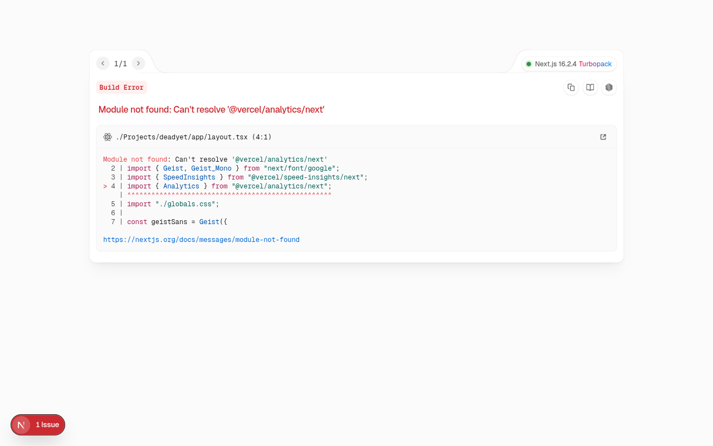

# Is ___ dead yet?

**Live site:** [deadyet.wtf](https://deadyet.wtf)

---

A public service for the impatient. Check if notable people — heroes, villains, legends, and cautionary tales — are still breathing.

Small spin. Small commentary. All facts.

## What This Is

A single-search site that answers life's most morbidly practical question about public figures. Type a name. Get a status. Move on with your day.

You'll notice the color coding isn't just random. Some statuses feel like better news than others — that's intentional.

## How It Works

- **Alive** or **Dead** — color-coded for your emotional convenience
- Auto-generated pages for each entry
- Photos, birth years, and the occasional mugshot
- Sourced from Wikipedia, because the crowd is usually right about these things

## Request an Addition

Can't find someone? [Submit a request](https://deadyet.wtf/submit) and tell me who you want to see added.

> **Note:** We only accept additions that are public or famous people. No adding your baby mama, abusive dad, etc. (Fuck them, though)

## FAQ

- **Q: Why did you build this?**
  - A: I was bored, why else?
- **Q: How do you decide who gets added?**
  - A: [User request](https://deadyet.wtf/submit).
- **Q: What does the color coding mean?**
  - A: Green = good thing. Red = bad thing.
- **Q: The data looks wrong. How do I report it?**
  - A: If it's a factual error, [submit a request](https://deadyet.wtf/submit). If your feelings are hurt, die mad.
- **Q: Is this a political statement?**
  - A: Isn't everything?

## Disclaimer

All data is pulled from public sources and updated automatically. This site is strictly informational — a pragmatic reference, not a wish list.

---

*Built with Next.js, TypeScript, Wikipedia, Wikidata, and a sense of civic duty.*
